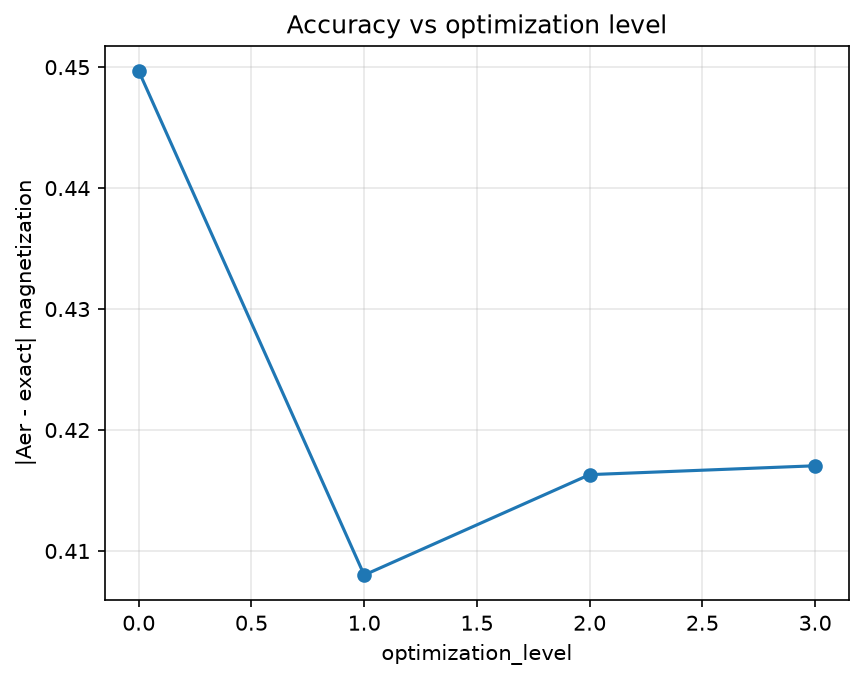
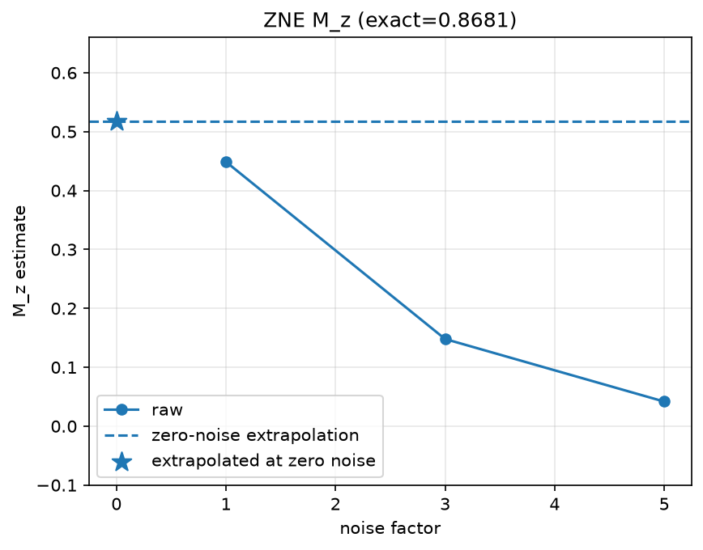

<<<<<<< HEAD
# Quantum Hardware Simulation: Transverse-Field Ising Model (TFIM)

This project implements a hardware-side module for simulating the **Transverse-Field Ising Model (TFIM)** on IBM Quantum hardware using Trotterization. The goal is to evaluate the impact of different transpilation strategies and error mitigation techniques on simulation accuracy.

## 🚀 Features

- **Trotterized TFIM Circuit Generation**: Constructs the canonical periodic-ring TFIM circuit for even $N$, using symmetric second-order Trotterization and fused transverse-field rotations.
- **Transpilation Analysis**: Compares Qiskit's optimization levels (0 to 3) by measuring circuit depth, gate counts (specifically CNOTs), and estimating overall circuit error.
- **Hardware-Aware Optimization**: Implements a greedy qubit selection algorithm that picks physical qubits with the lowest readout and gate error rates, and maps the circuit to this optimal layout.
- **Error Mitigation (ZNE)**: Implements Zero-Noise Extrapolation (ZNE) via manual unitary folding to mitigate hardware noise.
- **Hybrid Execution**: Supports execution on `qiskit-aer` (simulators) and real IBM Quantum backends via `qiskit-ibm-runtime`.
- **Analysis Suite**: Calculates exact magnetization using numerical diagonalization as a baseline and generates accuracy and depth plots.

## 🛠️ Installation

### Prerequisites
- Python 3.10+
- An IBM Quantum account and API token.

### Dependencies
Install the required packages:
```bash
pip install "qiskit[visualization]" "qiskit-aer" "qiskit-ibm-runtime" scipy matplotlib pandas
```

## ⚙️ Configuration

1. Create a `.env` file in the root directory:
   ```bash
   cp .env.example .env
   ```
2. Edit the `.env` file and add your IBM Quantum token:
   ```env
   QISKIT_IBM_TOKEN=your_api_token_here
   ```

## 💻 Usage

### Running the Module
You can run the full simulation pipeline from the command line:

```bash
# Run with simulator only
python hardware.py --n 4 --steps 3 --shots 4096 --no-hardware

# Run on a specific IBM Quantum backend
python hardware.py --n 4 --steps 3 --shots 4096 --backend ibm_marrakesh
```

### Using the Notebook
For a step-by-step walkthrough, open `demo.ipynb` in Jupyter or Google Colab. The notebook demonstrates:
1. Backend setup and property inspection.
2. Circuit construction.
3. Transpilation level comparison.
4. Hardware-aware layout selection.
5. Execution and ZNE mitigation.

## 📊 Outputs & Visualization

The pipeline saves results to the root folder:
- `tfim_results.json`: Detailed metadata, transpilation stats, and expectation values.

### Results Preview

| Accuracy vs Optimization Level | Depth vs Optimization Level | Error Mitigation (ZNE) |
| :---: | :---: | :---: |
|  |  |  |

**N=6, periodic ring, 2nd-order Trotter, fake-backend ibm_marrakesh.**

- **Accuracy vs Level**: Compares noisy magnetization errors for fake-backend transpilation levels 0–3.
- **Depth vs Level**: Shows transpiled depths for optimization levels 0–3.
- **ZNE Plot**: Shows raw noisy samples and their zero-noise linear extrapolation.

### Reproducibility

Regenerate these plots with:

```bash
python hardware.py --n 6 --steps 20 --dt 0.05 --fake-backend ibm_marrakesh --noise simple --outdir results_canonical
```

The local `simple` noise model uses the project's 1% single-qubit and 3% two-qubit depolarizing rates.

## 📝 License
This project is developed for the Qiskit Fall Fest 2026.
=======
<<<<<<< Updated upstream
# TFIM on IBM Quantum Hardware — hardware.py

Trotterized Transverse-Field Ising Model with transpilation comparison,
hardware-aware layout, ZNE mitigation, Aer + IBM hardware execution,
exact-diagonalization analysis. Qiskit 1.0+ (tested 2.5.2).

## Quick start (cloud — recommended for Fall Fest)

Local Windows Smart App Control can block `qiskit._accelerate.pyd`
(unsigned native lib). If `import qiskit` fails locally, run in Colab:

```python
!pip install "qiskit[visualization]==2.5.2" "qiskit-aer==0.17.2" \
  "qiskit-machine-learning==0.9.1" "qiskit-ibm-runtime==0.50.0" \
  "scipy==1.18.1" "scikit-learn==1.9.1" "matplotlib==3.11.2" "pandas==3.0.6"
```

Upload `hardware.py`, then open `demo.ipynb`.

## Local setup

```powershell
py -3.12 -m venv qff26
.\qff26\Scripts\Activate.ps1
python -m pip install --upgrade pip
python -m pip install "qiskit[visualization]==2.5.2" "qiskit-aer==0.17.2" ^
  "qiskit-machine-learning==0.9.1" "qiskit-ibm-runtime==0.50.0" ^
  "scipy==1.18.1" "scikit-learn==1.9.1" "matplotlib==3.11.2" "pandas==3.0.6"
copy .env.example .env
# edit .env with your PINQ2 token (Fall Fest shared allocation, keep private)
```

## Usage

```powershell
# Aer only (no token needed)
python hardware.py --n 4 --steps 3 --shots 4096 --no-hardware --outdir results

# With IBM hardware (reads .env)
python hardware.py --n 4 --steps 3 --shots 4096 --outdir results
python hardware.py --backend ibm_marrakesh --n 5 --outdir results
```

## What it does

1. `get_service()` / `select_backend()` — `QiskitRuntimeService(channel, token)`,
   prefers `ibm_marrakesh`/`ibm_fez`; prints qubits, coupling map, basis gates,
   median 1q/2q/readout errors.
2. `build_tfim_circuit(N,J,h,dt,steps)` — RZZ(-2J·dt) + RX(-2h·dt) Trotter layers.
   `build_tfim_observables()` — energy + magnetization `SparsePauliOp`s.
3. `transpile_compare()` — levels 0–3: depth, gate counts, CX-like, est. error
   `1-Π(1-e)` from `backend.target`.
4. `select_best_qubits()` — greedy lowest-error connected chain from
   `backend.target` + `coupling_map`; `hardware_aware_transpile()` uses it as
   `initial_layout` (lv3) vs default (lv1).
5. ZNE — Runtime: `EstimatorV2(resilience_level=2, zne_mitigation=True)`;
   Aer: manual unitary folding of CX/CZ/ECR at scales 1/3/5 + linear/exponential
   extrapolation to zero noise.
6. Execution — Aer `AerSimulator`/`EstimatorV2`; hardware `SamplerV2`/`EstimatorV2`
   in a `Session`. Returns counts + expectation values.
7. Analysis — exact magnetization via `scipy.linalg.expm` vs Aer/hardware;
   plots `accuracy_vs_level.png`, `depth_vs_level.png`, `error_vs_mitigation.png`;
   results in `results/tfim_results.json`.

## Cost note

Real QPUs queue and consume QPU-seconds. Start Aer-only, then 1 short hardware
job (few thousand shots). Shared Fall Fest allocation: use only for event jobs.

## Example Output

### Console Output (Aer-only run)
```text
[circuit] TFIM N=4 depth=13 gates={'rx': 12, 'rzz': 9, 'measure': 4, 'barrier': 3}
[exact] magnetization=0.958518
[backend] No QISKIT_IBM_TOKEN found — offline/Aer mode.
level  depth  gates    cx   est_err
    0     13     28     0       n/a
    1     13     28     0       n/a
    2     13     28     0       n/a
    3     13     28     0       n/a
[zne-aer] raw=[0.958186, 0.958186, 0.958186] → mitigated(linear)=0.958186
[out] JSON → results\tfim_results.json
[out] PNG → results\accuracy_vs_level.png
[out] PNG → results\depth_vs_level.png
[out] PNG → results\error_vs_mitigation.png
[done] 10.1s → results/
```

### Generated Plots

| Plot | Description |
|------|-------------|
| `accuracy_vs_level.png` | Absolute error vs exact magnetization across optimization levels 0–3 |
| `depth_vs_level.png` | Transpiled circuit depth vs optimization level |
| `error_vs_mitigation.png` | Bar chart: plain Aer error vs ZNE-mitigated error |


### JSON Output (`results/tfim_results.json`)
```json
{
  "meta": {
    "time": "2026-10-05T15:37:57.338121+00:00",
    "seed": 42,
    "params": {"n": 4, "J": 1.0, "h": 0.5, "dt": 0.1, "steps": 3, "shots": 4096},
    "versions": {"qiskit": "2.5.2", "qiskit_aer": "0.17.2", "qiskit_ibm_runtime": "0.50.0", "numpy": "2.5.3", "scipy": "1.18.1"},
    "wall_s": 7.16
  },
  "exact_magnetization": 0.9585181029259411,
  "aer_expectations": {"0": 0.958186, "1": 0.958186, "2": 0.958186, "3": 0.958186},
  "zne_aer": {"mitigated": 0.958186, "raw": [0.958186, 0.958186, 0.958186]},
  "analysis": {
    "exact": 0.958518,
    "table": [
      {"optimization_level": 0, "depth": 13, "total_gates": 28, "cx_like": 0, "aer_value": 0.958186, "abs_error": 0.000332},
      {"optimization_level": 1, "depth": 13, "total_gates": 28, "cx_like": 0, "aer_value": 0.958186, "abs_error": 0.000332},
      {"optimization_level": 2, "depth": 13, "total_gates": 28, "cx_like": 0, "aer_value": 0.958186, "abs_error": 0.000332},
      {"optimization_level": 3, "depth": 13, "total_gates": 28, "cx_like": 0, "aer_value": 0.958186, "abs_error": 0.000332},
      {"optimization_level": "zne", "mitigated": 0.958186, "raw": [0.958186, 0.958186, 0.958186]}
    ]
  }
}
```

## Files

- `hardware.py` — full module + CLI
- `demo.ipynb` — Aer demo + hardware snippet (skips cleanly without token)
- `.env.example` — token template
=======
<<<<<<< Updated upstream
# Quantum Hardware Simulation: Transverse-Field Ising Model (TFIM)

This project implements a hardware-side module for simulating the **Transverse-Field Ising Model (TFIM)** on IBM Quantum hardware using Trotterization. The goal is to evaluate the impact of different transpilation strategies and error mitigation techniques on simulation accuracy.

## 🚀 Features

- **Trotterized TFIM Circuit Generation**: Constructs the canonical periodic-ring TFIM circuit for even $N$, using symmetric second-order Trotterization and fused transverse-field rotations.
- **Transpilation Analysis**: Compares Qiskit's optimization levels (0 to 3) by measuring circuit depth, gate counts (specifically CNOTs), and estimating overall circuit error.
- **Hardware-Aware Optimization**: Implements a greedy qubit selection algorithm that picks physical qubits with the lowest readout and gate error rates, and maps the circuit to this optimal layout.
- **Error Mitigation (ZNE)**: Implements Zero-Noise Extrapolation (ZNE) via manual unitary folding to mitigate hardware noise.
- **Hybrid Execution**: Supports execution on `qiskit-aer` (simulators) and real IBM Quantum backends via `qiskit-ibm-runtime`.
- **Analysis Suite**: Calculates exact magnetization using numerical diagonalization as a baseline and generates accuracy and depth plots.

## 🛠️ Installation

### Prerequisites
- Python 3.10+
- An IBM Quantum account and API token.

### Dependencies
Install the required packages:
```bash
pip install "qiskit[visualization]" "qiskit-aer" "qiskit-ibm-runtime" scipy matplotlib pandas
```

## ⚙️ Configuration

1. Create a `.env` file in the root directory:
   ```bash
   cp .env.example .env
   ```
2. Edit the `.env` file and add your IBM Quantum token:
   ```env
   QISKIT_IBM_TOKEN=your_api_token_here
   ```

## 💻 Usage

### Running the Module
You can run the full simulation pipeline from the command line:

```bash
# Run with simulator only
python hardware.py --n 4 --steps 3 --shots 4096 --no-hardware

# Run on a specific IBM Quantum backend
python hardware.py --n 4 --steps 3 --shots 4096 --backend ibm_marrakesh
```

### Using the Notebook
For a step-by-step walkthrough, open `demo.ipynb` in Jupyter or Google Colab. The notebook demonstrates:
1. Backend setup and property inspection.
2. Circuit construction.
3. Transpilation level comparison.
4. Hardware-aware layout selection.
5. Execution and ZNE mitigation.

## 📊 Outputs & Visualization

The pipeline saves results to the root folder:
- `tfim_results.json`: Detailed metadata, transpilation stats, and expectation values.

### Results Preview

| Accuracy vs Optimization Level | Depth vs Optimization Level | Error Mitigation (ZNE) |
| :---: | :---: | :---: |
|  |  |  |

**N=6, periodic ring, 2nd-order Trotter, fake-backend ibm_marrakesh.**

- **Accuracy vs Level**: Compares noisy magnetization errors for fake-backend transpilation levels 0–3.
- **Depth vs Level**: Shows transpiled depths for optimization levels 0–3.
- **ZNE Plot**: Shows raw noisy samples and their zero-noise linear extrapolation.

### Reproducibility

Regenerate these plots with:

```bash
python hardware.py --n 6 --steps 20 --dt 0.05 --fake-backend ibm_marrakesh --noise simple --outdir results_canonical
```

The local `simple` noise model uses the project's 1% single-qubit and 3% two-qubit depolarizing rates.

## 📝 License
This project is developed for the Qiskit Fall Fest 2026.
=======
# Quantum Hardware Simulation: Transverse-Field Ising Model (TFIM)

This project implements a hardware-side module for simulating the **Transverse-Field Ising Model (TFIM)** on IBM Quantum hardware using Trotterization. The goal is to evaluate the impact of different transpilation strategies and error mitigation techniques on simulation accuracy.

## 🚀 Features

- **Trotterized TFIM Circuit Generation**: Constructs the canonical periodic-ring TFIM circuit for even $N$, using symmetric second-order Trotterization and fused transverse-field rotations.
- **Transpilation Analysis**: Compares Qiskit's optimization levels (0 to 3) by measuring circuit depth, gate counts (specifically CNOTs), and estimating overall circuit error.
- **Hardware-Aware Optimization**: Implements a greedy qubit selection algorithm that picks physical qubits with the lowest readout and gate error rates, and maps the circuit to this optimal layout.
- **Error Mitigation (ZNE)**: Implements Zero-Noise Extrapolation (ZNE) via manual unitary folding to mitigate hardware noise.
- **Hybrid Execution**: Supports execution on `qiskit-aer` (simulators) and real IBM Quantum backends via `qiskit-ibm-runtime`.
- **Analysis Suite**: Calculates exact magnetization using numerical diagonalization as a baseline and generates accuracy and depth plots.

## 🛠️ Installation

### Prerequisites
- Python 3.10+
- An IBM Quantum account and API token.

### Dependencies
Install the required packages:
```bash
pip install "qiskit[visualization]" "qiskit-aer" "qiskit-ibm-runtime" scipy matplotlib pandas
```

## ⚙️ Configuration

1. Create a `.env` file in the root directory:
   ```bash
   cp .env.example .env
   ```
2. Edit the `.env` file and add your IBM Quantum token:
   ```env
   QISKIT_IBM_TOKEN=your_api_token_here
   ```

## 💻 Usage

### Running the Module
You can run the full simulation pipeline from the command line:

```bash
# Run with simulator only
python hardware.py --n 4 --steps 3 --shots 4096 --no-hardware

# Run on a specific IBM Quantum backend
python hardware.py --n 4 --steps 3 --shots 4096 --backend ibm_marrakesh
```

### Using the Notebook
For a step-by-step walkthrough, open `demo.ipynb` in Jupyter or Google Colab. The notebook demonstrates:
1. Backend setup and property inspection.
2. Circuit construction.
3. Transpilation level comparison.
4. Hardware-aware layout selection.
5. Execution and ZNE mitigation.

## 📊 Outputs & Visualization

The pipeline saves results to the root folder:
- `tfim_results.json`: Detailed metadata, transpilation stats, and expectation values.

### Results Preview

| Accuracy vs Optimization Level | Depth vs Optimization Level | Error Mitigation (ZNE) |
| :---: | :---: | :---: |
|  |  |  |

**N=6, periodic ring, 2nd-order Trotter, fake-backend ibm_marrakesh.**

- **Accuracy vs Level**: Compares noisy magnetization errors for fake-backend transpilation levels 0–3.
- **Depth vs Level**: Shows transpiled depths for optimization levels 0–3.
- **ZNE Plot**: Shows raw noisy samples and their zero-noise linear extrapolation.

### Reproducibility

Regenerate these plots with:

```bash
python hardware.py --n 6 --steps 20 --dt 0.05 --fake-backend ibm_marrakesh --noise simple --outdir results_canonical
```

The `simple` noise model uses 0.04% one-qubit depolarizing error, 0.3% two-qubit depolarizing error, and 0.3% readout error.

## 📝 License
This project is developed for the Qiskit Fall Fest 2026.
>>>>>>> Stashed changes
>>>>>>> Stashed changes
>>>>>>> 32cf08330958050c0b1b6fe0319511cdf646cf23
